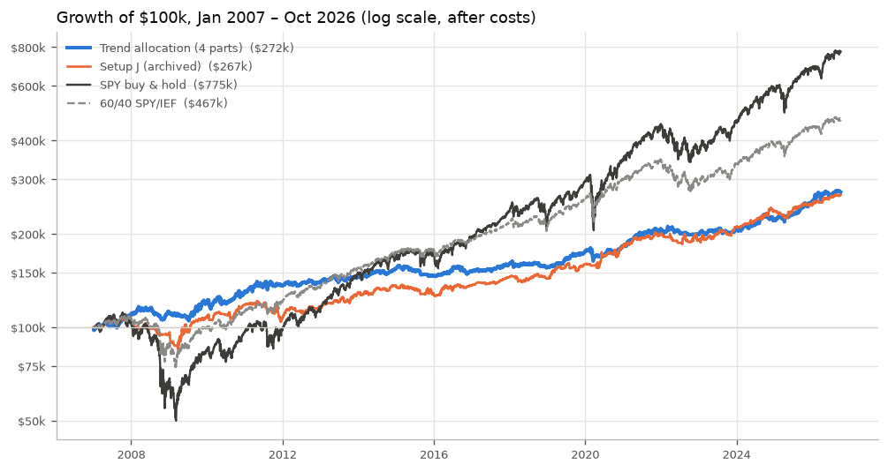
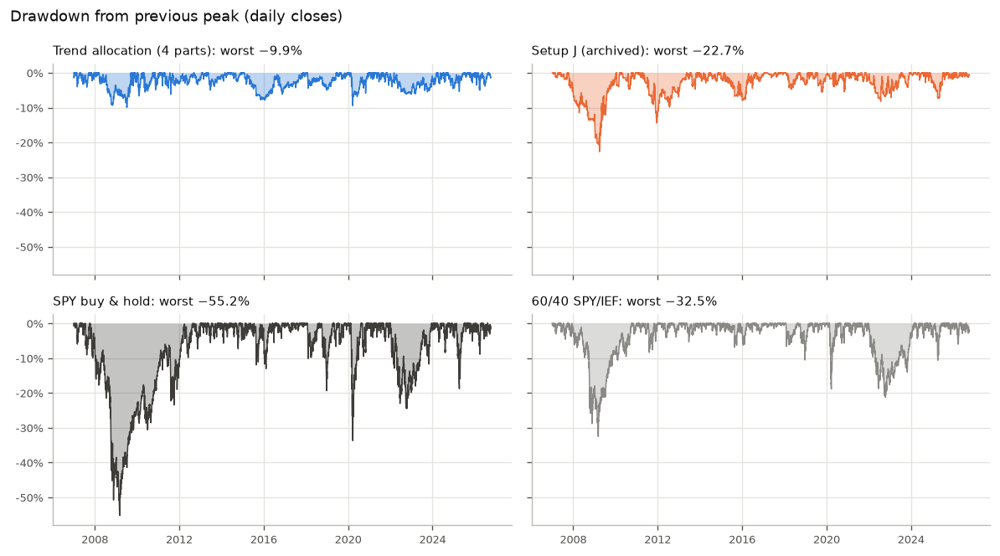
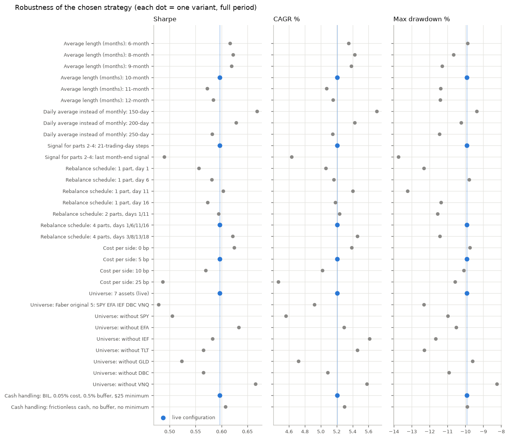
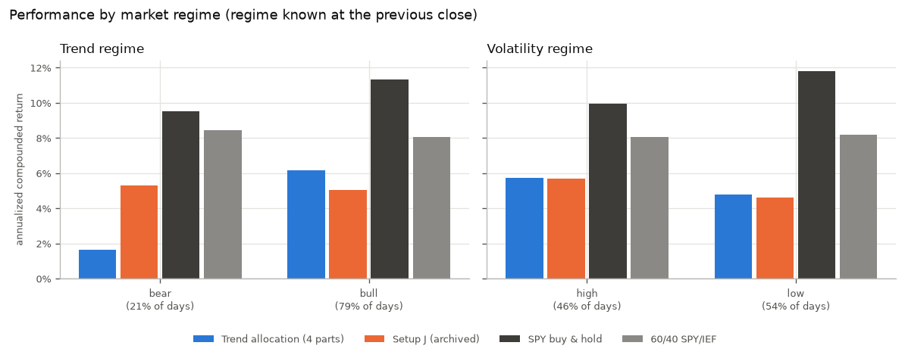

# Trend Allocation Trading Bot

[](https://github.com/aidaman01/ma-crossover-trading-bot/actions/workflows/ci.yml)

A research project and live paper-trading bot that tests whether a simple **trend-following
asset allocation** (Faber, 2007) offers a better trade-off between return and loss than
holding stocks or a 60/40 portfolio, after costs and without look-ahead bias. The bot trades
the strategy on an Alpaca **paper** account; a 20-year backtest, robustness and regime
analysis, and 61 offline tests support the research.

**Live dashboard:** [ma-croappver-trading-bot.streamlit.app](https://ma-croappver-trading-bot-97vt9hjg2mof9trvutuqf6.streamlit.app/) ·
**Full report:** [`docs/research.md`](docs/research.md)

> **Disclaimer:** educational project, **not financial advice**. The bot places real orders
> only on an Alpaca **paper trading** account (simulated money, `DRY_RUN = False`,
> `PAPER_TRADING = True`). Backtested results do not predict future performance.

## In one minute

- **Question:** does holding each asset class only while it is in an uptrend reduce losses
  enough to be worth the lower returns?
- **Strategy:** 7 ETFs (US and international stocks, two Treasury ETFs, gold, commodities,
  real estate). Each gets 1/7 of the portfolio while its price is above its 10-month average;
  otherwise that 1/7 goes to T-bills (BIL). Four sub-portfolios rebalance on different days.
- **Result (2007–2026, after costs):** 5.2% a year with a −9.9% maximum drawdown, vs 10.9% /
  −55.2% for SPY and 8.1% / −32.5% for 60/40. Its Sharpe ratio (0.60) is similar to 60/40's
  (0.63). It controls losses; it does **not** beat the market.
- **Caveat:** the strategy was chosen by comparing five approaches on this same history, so
  the results are **in-sample**. The only true out-of-sample test is the paper trading that
  started on 2026-10-05.

## Research Results

2007-01-03 to 2026-10-02, $100k start, 0.05% cost per side on every trade, dividend-adjusted
prices, daily data ([full tables](docs/research/tables.md)).

| Strategy | CAGR | Volatility | Sharpe | Sortino | Max Drawdown | Worst year |
|---|---:|---:|---:|---:|---:|---:|
| **Trend Allocation (4 parts)** | **5.2%** | **6.4%** | **0.60** | **0.82** | **−9.9%** | **−4.9%** |
| Setup J (archived EMA crossover) | 5.1% | 7.7% | 0.50 | 0.70 | −22.7% | −9.5% |
| SPY buy & hold | 10.9% | 19.5% | 0.55 | 0.78 | −55.2% | −36.8% |
| 60/40 SPY/IEF | 8.1% | 11.0% | 0.63 | 0.89 | −32.5% | −17.9% |

Sharpe and Sortino use daily excess returns over the T-bill/BIL rate, annualized with √252.
All metric definitions: [`docs/research.md#risk-metrics`](docs/research.md#risk-metrics).





**Stress years** (calendar return): 2008 +1.9% (SPY −36.8%), 2020 +4.5% (SPY +18.3%),
2022 −4.1% (SPY −18.2%, 60/40 −16.6%).

## How the strategy works

| Asset | ETF | | Asset | ETF |
|---|---|---|---|---|
| US stocks | SPY | | Gold | GLD |
| International stocks | EFA | | Commodities | DBC |
| 7–10y Treasuries | IEF | | US real estate | VNQ |
| 20y+ Treasuries | TLT | | **Defensive / cash** | **BIL** (0–3 month T-bills) |

1. **10-month trend signal:** an asset is in trend when its close is above the average of its
   last 10 monthly closes (including the current one).
2. **Weights:** 1/7 for each asset in trend; everything else goes to **BIL**. If nothing is in
   trend, the portfolio is 100% BIL.
3. **Four tranches:** the account is split into four parts that rebalance on trading days
   1, 6, 11 and 16 of each month. This spreads the "timing luck" of one rebalance date. Part 1
   uses calendar month-end closes; parts 2–4 use closes every 21 trading days back from their
   signal date (an approximation of a month, tested in the report).
4. **Live execution:** each part keeps 0.5% in cash, orders below $25 are skipped, sells go
   before buys, no margin. Rules live in [`allocation.py`](allocation.py), shared by the bot
   and the research.

## How the backtest works

- **No look-ahead:** each rebalance uses closes up to the **previous** trading day and fills
  at the next **open**. [`tests/test_lookahead.py`](tests/test_lookahead.py) changes future
  prices (and the rebalance day's own close) and requires identical signals, orders and
  equity; a deliberately planted leak makes those tests fail.
- **Costs:** 0.05% per side on every buy and sell, **including BIL**.
- **Accounting:** explicit shares and cash, equity marked at every close; idle money is
  held in BIL; the four parts are simulated as separate sub-portfolios.
- **Benchmarks:** SPY buy & hold, 60/40 SPY/IEF rebalanced monthly, and the archived setup J
  (run with the live bot's own decision code).
- **Data:** Yahoo Finance via yfinance (adjusted for splits and dividends) up to a fixed end
  date, with SHA-256 checksums of every input series in
  [`docs/research/data_manifest.json`](docs/research/data_manifest.json).

## How the strategy was chosen (in-sample)

Five approaches were compared on the same 2007–2026 data: (1) trend allocation, (2) dual
momentum, (3) trend allocation with a 10% volatility target, (4) "hold by default" on 12 US
ETFs, (5) setup J with a trailing stop. Approach 4 had the best Sharpe with a single
rebalance day (0.70), but its drawdown ranged from −16.4% to −29.9% depending on the day of
the month; with four parts it stayed between −22.1% and −23.8%, failing the pre-set rule
(drawdown ≈ −20% or better and Sharpe above 60/40). Approach 1 was chosen.

**Because the choice was made on the same data that is reported, it is in-sample model
selection.** The 2007–2014 / 2015–2026 split below is a robustness check, not out-of-sample
proof:

| Sharpe ratio | 2007–2014 | 2015–2026 |
|---|---:|---:|
| Trend allocation | 0.68 | 0.53 |
| Setup J | 0.39 | 0.60 |
| SPY | 0.38 | 0.71 |
| 60/40 | 0.57 | 0.68 |

## Robustness and market regimes

Each variant changes one assumption of the live setup:

- **Average length 6–12 months:** Sharpe 0.57–0.62, CAGR 5.1–5.4%. No sharp optimum.
- **Costs 0 / 5 / 10 / 25 bp per side:** CAGR 5.4 / 5.2 / 5.0 / 4.5%.
- **Universe:** Faber's original five assets (no TLT, no GLD) gave Sharpe 0.48 and −12.3%
  drawdown, so part of the result comes from the hindsight choice of the 7 ETFs.
- **Signal for parts 2–4:** fresh 21-day-step signals beat stale month-end signals (Sharpe
  0.60 vs 0.49).



**Regimes** are defined with information available at the previous close: *bull/bear* =
SPY above/below its 200-day average; *high/low volatility* = SPY's 63-day realized
volatility above/below its expanding median. The strategy's volatility stayed about 6.4% in
every regime, but it did **not** earn more in bear regimes (1.6% a year vs 9.5% for SPY,
whose biggest rebounds happen below the 200-day average). Its value is a smoother path, not
crisis profits.



## Limitations

- In-sample model selection (five approaches, universe and tranche design chosen on the
  same data); reported performance is biased upward by an unknown amount.
- Universe hindsight: the 7 ETFs were picked in 2026; the original Faber universe did worse.
- 20 years of ETF data; one financial crisis, one pandemic crash, one inflation shock.
- Flat costs; no spreads widening in crises, market impact, partial fills or taxes.
- Yahoo Finance adjusted data is a total-return proxy and is revised over time.
- Simplifications: 21-trading-day steps for parts 2–4, forward-filled gaps (≤ 5 days),
  fills at the open.
- Full discussion: [`docs/research.md#limitations`](docs/research.md#limitations).

## Live paper-trading bot

[`bot.py`](bot.py) runs once per trading day at 9:35 ET (Windows Task Scheduler,
[`schedule_task.ps1`](schedule_task.ps1)): it downloads daily closes, computes the signals from
**completed** bars only, finds which of the four parts are due (Alpaca market calendar),
reconciles its records with the real account, and sends market orders. Every run is logged to
`logs/allocation_runs.csv`. Setup J remains available as `STRATEGY = "ema_crossover"` in
[`config.py`](config.py).

The read-only [Streamlit dashboard](streamlit_app.py) shows the account, today's signals, the run
history and the research results (interactive equity, drawdown, rolling statistics,
robustness and regime views computed from the research outputs).

## Run it locally

```bash
git clone https://github.com/aidaman01/ma-crossover-trading-bot
cd ma-crossover-trading-bot
pip install -r requirements-dev.txt

pytest                         # 61 offline tests (network blocked, no API keys)
ruff check . && mypy           # lint and type check (also run by CI)
python research.py             # download data ending 2026-10-02, write docs/research/
python research.py --offline   # rerun from data/cache/, verify SHA-256 checksums
streamlit run streamlit_app.py # dashboard (Alpaca keys from .streamlit/secrets.toml, optional)
```

To run the bot itself, copy `.env.example` to `.env` with Alpaca **paper** keys and run
`python bot.py --dry-run` (logs only) or `python bot.py` (uses `DRY_RUN` in `config.py`).

## Project structure

```
research.py          research pipeline: approaches, benchmarks, robustness, regimes, outputs
research_data.py     data download (fixed end date), cache, SHA-256 manifest, Market
metrics.py           performance metrics (CAGR, Sharpe, Sortino, drawdown, ...), documented
regimes.py           bull/bear and volatility regimes using only past information
research_charts.py   README / report charts
allocation.py        trend and hold-by-default rules, shared by the bot and the research
bot.py, config.py    live paper-trading bot and its settings
indicators.py        EMA/SMA, RSI, MACD, ATR, ADX (setup J)
backtest.py          archived setup J study (2021–2026)
streamlit_app.py     read-only dashboard
tests/               61 offline pytest tests (look-ahead, engine, metrics, live allocation, data)
docs/research.md     research report;  docs/research/  tables, CSVs, charts, data manifest
.github/workflows/   CI: ruff, mypy, pytest
```

## License

[MIT](LICENSE). Educational use only; not financial advice.
