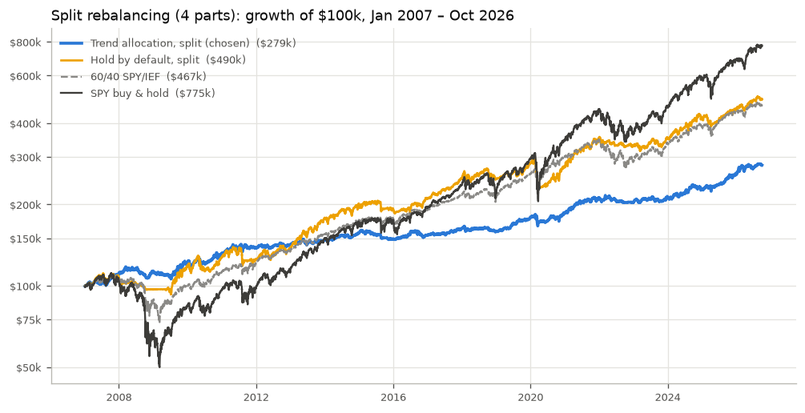
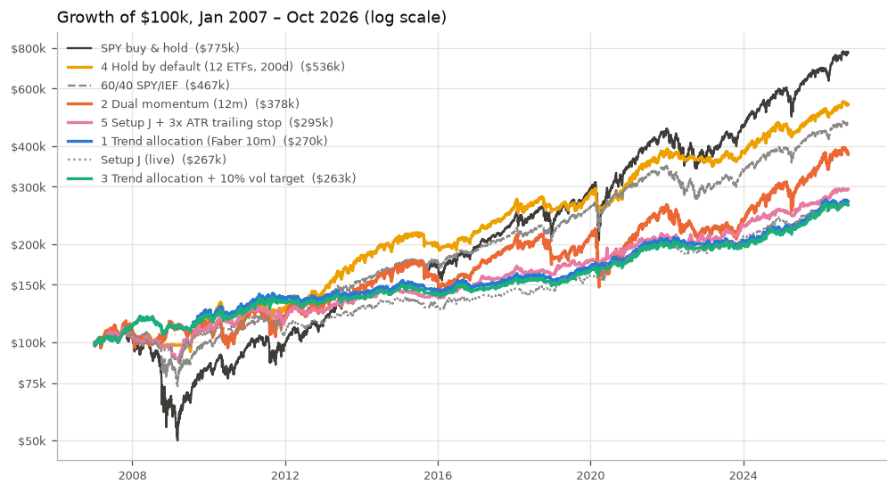
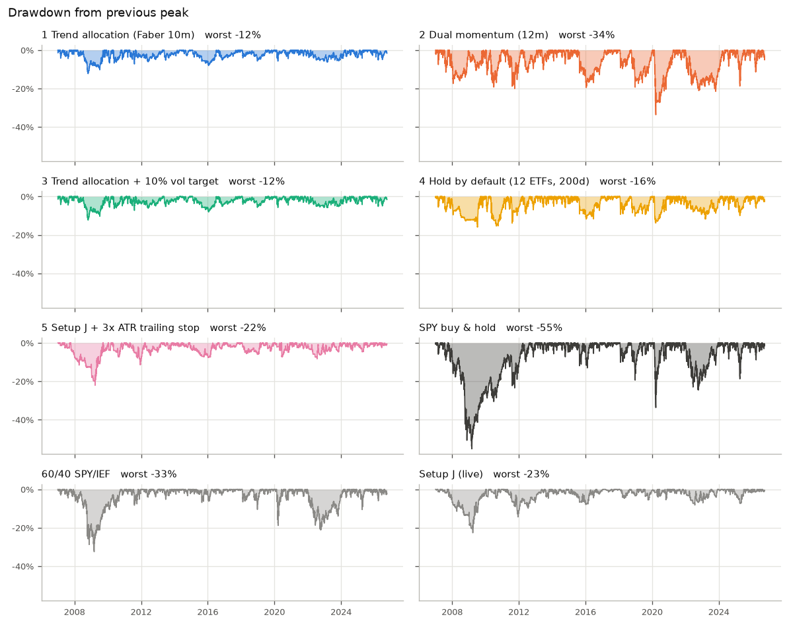
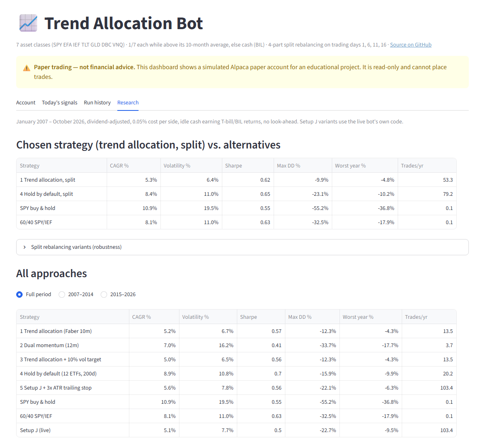

# Trend Allocation Trading Bot

An automated, monthly **trend-following asset allocation** bot for an **Alpaca paper
trading** account. It holds seven asset classes (US stocks, international stocks, two bond
ETFs, gold, commodities and real estate) and keeps each one only while it is in an uptrend;
the rest sits in a T-bill ETF. The portfolio is split into four parts that rebalance on
different days of the month.

The strategy was chosen by a 20-year research framework (no look-ahead, costs, cash
yield, split-sample and sensitivity checks) that compared five well-documented approaches
against SPY, 60/40 and this bot's earlier EMA crossover setup, which is kept as an
archived option. A read-only Streamlit dashboard shows the account, today's signals, the
run history and the research.

**Live dashboard:** [ma-croappver-trading-bot.streamlit.app](https://ma-croappver-trading-bot-97vt9hjg2mof9trvutuqf6.streamlit.app/)


> **Disclaimer:** This project is for educational purposes only and is **not financial
> advice**. Dry-run is **off** (`DRY_RUN = False`): the bot places real orders, but only on
> an Alpaca **paper trading** account (simulated money). Trading involves risk of loss; past
> or backtested performance does not predict future results. Use at your own risk.

## Features

- **Strategy:** trend allocation (Faber-style): 1/7 in each of SPY, EFA, IEF, TLT, GLD, DBC,
  VNQ while its price is above its 10-month average, otherwise cash in BIL
- **Split rebalancing:** four parts rebalancing on trading days 1, 6, 11 and 16 of each month
- **Research framework:** [`research.py`](research.py), 2007–2026, five approaches + benchmarks,
  split halves, stress years, parameter and timing sensitivity, log-scale charts
- **Shared code:** the live bot and the research use the same rules ([`allocation.py`](allocation.py))
- **Safety:** never uses margin, sells anything outside the strategy, reconciles its records
  with the real account every run, catches up missed rebalance days, dry-run mode
- **Scheduler:** runs once per trading day at 9:35 AM US Eastern from any time zone
- **Dashboard:** read-only Streamlit app with account, signals, run history and research
- **Archived option:** the earlier daily EMA 10/30 crossover (setup J), one setting away

## Strategy

| Setting (`config.py`) | Value |
|---|---|
| `STRATEGY` | `"trend_allocation"` |
| Assets (`ALLOCATION_ASSETS`) | SPY (US stocks), EFA (international stocks), IEF (7–10y Treasuries), TLT (20y+ Treasuries), GLD (gold), DBC (commodities), VNQ (real estate) |
| Trend rule | hold an asset while its close is above its **10-month average** (`ALLOCATION_MA_MONTHS`) |
| Weights | 1/7 per asset in an uptrend; everything else in **BIL** (`CASH_SYMBOL`, 0–3 month T-bills) |
| Split rebalancing | 4 parts (`TRANCHES`), each rebalancing on trading day 1, 6, 11 or 16 (`TRANCHE_SPACING_DAYS = 5`) |
| Cash buffer | each part keeps 0.5% in cash (`CASH_BUFFER_PCT`) so fills above the quote never use margin |
| Mode | `DRY_RUN = False`: live orders on the paper account (`PAPER_TRADING = True`) |

**How a run works** ([`bot.py`](bot.py) `run_allocation`):

1. Download daily closes and compute each asset's trend from **completed** bars only.
   The first part, which rebalances on the first trading day of the month, uses
   calendar month-end closes. The later parts use the same rule with 21-trading-day steps
   ending the day before their rebalance.
2. The account is divided into four **virtual parts**, recorded in `bot_state.json`. Using
   Alpaca's market calendar, the bot works out the trading day of the month. Each part
   whose day has arrived (or was missed) moves to the new target weights; the others keep
   their holdings.
3. Orders move the real account to the sum of the four parts. Sells go first, buys are
   capped by the available cash (never margin), each part keeps a 0.5% cash buffer,
   orders under $25 are skipped, and fractional shares are used.
4. On the next run, the records are reconciled with the real positions (fills, rounding
   or manual trades), so they never drift from the account.

The first live run invests all four parts at once, so the account is fully allocated
immediately, even mid-month. After that, each part follows its own schedule: a first run on
trading day 3 sets up all parts, then parts 2, 3 and 4 rebalance on days 6, 11 and 16, and
from the next month on all four use their normal days.

## Why this strategy

From [`research.py`](research.py): January 2007 – October 2026, dividend-adjusted, 0.05%
cost per side, idle cash earning the 3-month T-bill rate (then BIL), monthly decisions
from closes through the previous trading day, executed at the next open.

| Strategy | CAGR | Volatility | Sharpe | Max DD | Worst year | Trades/yr |
|---|---:|---:|---:|---:|---:|---:|
| **Trend allocation, split (chosen)** | **5.3%** | **6.4%** | **0.62** | **−9.9%** | **−4.8% (2015)** | 53 |
| Hold by default (12 ETFs, 200-day), split | 8.4% | 11.0% | 0.65 | −23.1% | −10.2% (2008) | 79 |
| 60/40 SPY/IEF, monthly rebalanced | 8.1% | 11.0% | 0.63 | −32.5% | −17.9% (2008) | 0.1 |
| SPY buy & hold | 10.9% | 19.5% | 0.55 | −55.2% | −36.8% (2008) | 0.1 |

| Strategy | 2007–2014 | 2015–2026 | 2008 | 2020 | 2022 |
|---|---|---|---|---|---|
| **Trend allocation, split** | **+5.7% CAGR, Sharpe 0.71** | **+5.1%, 0.54** | **+2.0%** (worst DD −9.4%) | **+4.6%** (−9.5%) | **−4.0%** (−6.1%) |
| Hold by default, split | +9.0%, 0.74 | +8.0%, 0.59 | −10.2% (−10.3%) | −2.1% (−23.1%) | −6.4% (−8.4%) |
| 60/40 | +7.2%, 0.57 | +8.8%, 0.68 | −17.9% (−28.0%) | +16.4% (−18.9%) | −16.6% (−20.9%) |
| SPY | +6.9%, 0.38 | +13.8%, 0.71 | −36.8% (−47.6%) | +18.3% (−33.7%) | −18.2% (−24.5%) |



**The decision rule**, fixed before the split test: switch to *hold by default* only if
every split variant kept its worst drawdown at about −20% or better (≤ −22% counted as a
fail) **and** beat 60/40's Sharpe (0.63); otherwise use trend allocation.

| Split variant | CAGR | Sharpe | Max DD |
|---|---:|---:|---:|
| Trend allocation, 10-month (standard) | 5.3% | 0.62 | −9.9% |
| Trend allocation, 9-month | 5.5% | 0.64 | −11.3% |
| Trend allocation, 11-month | 5.2% | 0.59 | −11.4% |
| Trend allocation, days 3/8/13/18 | 5.6% | 0.64 | −11.5% |
| Hold by default, 200-day (standard) | 8.4% | 0.65 | −23.1% |
| Hold by default, 150-day | 7.8% | 0.61 | −23.0% |
| Hold by default, 250-day | 8.5% | 0.65 | −23.9% |
| Hold by default, days 3/8/13/18 | 8.6% | 0.67 | −22.1% |

Hold by default failed on drawdown in every variant (and on Sharpe at 150 days), so the bot
uses **trend allocation**. Its results barely move across averages and rebalance days, it
made money in 2008 and 2020 and lost only 4% in 2022, and splitting the rebalance improved
it (Sharpe 0.57 → 0.62, max drawdown −12.3% → −9.9%).

**The trade-off:** it earned about 5% a year, less than 60/40 (8%) and far less than SPY
(11%), because about a third of the money sits in T-bills on average. Its strength is small
losses, not high returns.

## Research: all approaches (single rebalance day)

`python research.py` writes `docs/research/` (CSVs and charts) and a full HTML report to
`backtests/research_report.html`. It never touches `config.py` or the live bot.

| Strategy (2007–2026) | CAGR | Volatility | Sharpe | Max DD | Worst year | Trades/yr |
|---|---:|---:|---:|---:|---:|---:|
| 1 Trend allocation (Faber, 10-month) | 5.2% | 6.7% | 0.57 | −12.3% | −4.3% (2022) | 13.5 |
| 2 Dual momentum (Antonacci, 12-month) | 7.0% | 16.2% | 0.41 | −33.7% | −17.7% (2022) | 3.7 |
| 3 Trend allocation + 10% vol target | 5.0% | 6.5% | 0.56 | −12.3% | −4.3% (2022) | 13.5 |
| 4 Hold by default (12 ETFs, 200-day) | 8.9% | 10.8% | 0.70 | −15.9% | −9.9% (2008) | 20.2 |
| 5 Setup J + 3× ATR trailing stop | 5.6% | 7.8% | 0.56 | −22.1% | −6.3% (2008) | 103 |
| SPY buy & hold | 10.9% | 19.5% | 0.55 | −55.2% | −36.8% (2008) | 0.1 |
| 60/40 SPY/IEF | 8.1% | 11.0% | 0.63 | −32.5% | −17.9% (2008) | 0.1 |
| Setup J (EMA 10/30, archived) | 5.1% | 7.7% | 0.50 | −22.7% | −9.5% (2011) | 103 |

- **Start date 2007-01-03:** DBC (commodities) starts 2006-02-06, the latest of all
  inputs, and its 11th month-end close is December 2006. That makes 2007-01-03, the first
  trading day of 2007, the first date on which 9-, 10- and 11-month averages all exist.
- **Trades/yr** counts positions opened plus positions closed.
- **No look-ahead,** verified: re-running with data cut off in mid-2016 gave identical
  trades and equity up to the cut. The setup J engine reproduces `backtest.py` exactly.
- **Sensitivity:** the trend allocation stayed within 4.9–5.5% CAGR and −9.8% to −13.4%
  drawdown across 9/10/11-month averages and four rebalance days. Hold by default kept its
  return but swung from −15.9% to −30.0% drawdown with the rebalance day. Dual momentum
  varied by 3.5 points of CAGR. Volatility targeting rarely acted, because the portfolio's
  own volatility (6.7%) was already below the 10% target.





### What could make it fail

- **Crashes inside a month:** monthly checks react late to very fast crashes.
- **Choppy, trendless markets:** small losses on every switch in and out (2011, 2015–16, 2018).
- **Diversifiers stop working:** stocks and bonds falling together (2022), a long
  rising-rate period hurting bonds after their 2007–2021 bull run, or commodities dragging.
- **Low cash rates:** about a third of the money sits in T-bills; near-zero rates (2009–2021) earn nothing.
- **Thin evidence:** 20 years contain one financial crisis, one pandemic crash and one
  inflation shock, and picking the best of five approaches on the same data flatters the winner.

## Project structure

```
bot.py              live bot: allocation mode (run_allocation) + archived EMA crossover (run_symbol)
allocation.py       trend / hold-by-default rules and month-end helpers, shared by bot and research
research.py         long-history research: 5 approaches, benchmarks, split rebalancing, sensitivity
config.py           strategy selector and all settings (setup J kept as an archived section)
indicators.py       SMA/EMA, RSI, MACD, ATR, ADX (setup J)
backtest.py         archived setup J backtester (2021–2026 setup comparison)
schedule_task.ps1   registers the Windows Task Scheduler job
streamlit_app.py    read-only dashboard
logs/               allocation_runs.csv and runs.csv (committed for the dashboard); bot.log is git-ignored
docs/research/      research results and charts;  docs/backtest/  archived setup J results
```

## Setup

Requires Python 3.10+ and a free [Alpaca](https://alpaca.markets) paper account.

```bash
git clone <this repo>
cd <repo>
pip install -r requirements.txt
cp .env.example .env        # Windows: copy .env.example .env
```

Put your Alpaca **paper** API keys in `.env` (git-ignored, never commit it):

```
ALPACA_API_KEY=your_api_key_here
ALPACA_SECRET_KEY=your_secret_key_here
```

## Running the bot

```bash
python bot.py               # uses DRY_RUN from config.py (currently False: paper orders)
python bot.py --dry-run     # never place orders
python bot.py --live        # place orders on the paper account
python research.py          # rerun the research
```

To pause trading but keep logging, set `DRY_RUN = True`. To run the archived strategy instead, set
`STRATEGY = "ema_crossover"` (or `"hold_by_default"` for the researched alternative).

Each run appends one row per asset to `logs/allocation_runs.csv` (close, average, trend,
target weight, current and target quantity, order, action, reason) and a readable line to
`logs/bot.log`. Excerpt from the dry run of 2026-10-04 (market closed; long line wrapped):

```
2026-10-02 SPY close=769.64 avg=721.56 above=True weight=14.3% | hold=0.0 target=18.5616 | DRY RUN: would BUY 18.5615
2026-10-02 GLD close=380.14 avg=408.64 above=False weight=0.0% | hold=0.0 target=0.0 | NO TRADE
2026-10-02 BIL close=91.43 avg= above= weight=57.1% | hold=0.0 target=624.9902 | DRY RUN: would BUY 624.99
ALLOCATION trend_allocation | trading day 2 of Oct; tranches rebalance on days [1, 6, 11, 16]; due: all (initial);
  new ledger: all tranches rebalance now; a live run now would be blocked: market closed (next open
  2026-10-05 09:30:00-04:00) | equity $100,000, buys $100,000, sells $0 | DRY RUN
```

## Scheduling (Windows Task Scheduler)

```powershell
powershell -ExecutionPolicy Bypass -File .\schedule_task.ps1
```

This registers a task named **Trading Bot**. US daylight saving moves 9:35 AM ET around in
other time zones, so instead of aiming for the exact minute:

1. The script converts 9:30 ET (summer and winter) to local time and fires every 5
   minutes across that window, Monday to Friday.
2. Each trigger runs `bot.py --scheduled`, which exits unless it is at or after 9:35 ET,
   the **Alpaca market clock** says the market is open (this skips weekends and holidays),
   and the bot hasn't already run today.
3. The task wakes the PC from sleep and runs as soon as possible after a missed start.
   Rebalance days missed while the PC was off are caught up on the next run.

```powershell
Get-ScheduledTask "Trading Bot" | Get-ScheduledTaskInfo   # last/next run, result (0 = OK)
Get-Content logs\scheduler.log -Tail 20
Disable-ScheduledTask "Trading Bot"                       # pause
Unregister-ScheduledTask "Trading Bot" -Confirm:$false    # remove
```

On macOS/Linux, a cron entry running `python bot.py --scheduled` every 5 minutes on
weekdays does the same job.

## Dashboard

[`streamlit_app.py`](streamlit_app.py) is **read-only**: no buttons place, change or cancel
orders. It reads the account, positions, portfolio history and market calendar from Alpaca,
and the logs and research results from the repo.

| Tab | Shows |
|---|---|
| Account | account value, cash, positions, market status, equity curve |
| Today's signals | each asset's close vs. its 10-month average, target vs. current weight, cash in BIL, today's trading day and the next part to rebalance |
| Run history | the last allocation run, submitted orders, all runs; archived setup J runs |
| Research | chosen strategy vs. alternatives, split variants, all approaches by period, charts, archived setup J backtest |

Add `?tab=signals`, `?tab=runs` or `?tab=research` to the URL to open a tab directly.



Run it locally with `streamlit run streamlit_app.py` after copying
`.streamlit/secrets.toml.example` to `.streamlit/secrets.toml` (git-ignored) and adding your
paper keys. The dashboard reads keys from **Streamlit secrets only**.

### Deploying on Streamlit Community Cloud (free)

1. Push this repo to GitHub.
2. At [share.streamlit.io](https://share.streamlit.io), click **Create app**, choose the repo,
   branch `main` and file `streamlit_app.py`; under **Advanced settings** pick Python 3.12 and
   paste your paper keys into **Secrets**:
   ```toml
   ALPACA_API_KEY = "your_paper_api_key"
   ALPACA_SECRET_KEY = "your_paper_secret_key"
   ```
3. Click **Deploy**. Secrets can be changed later under **Settings → Secrets**; the app picks
   them up without a restart.

Streamlit Community Cloud apps are public by default: anyone with the link sees the paper
account's balance and positions, never the keys.

## Archived: setup J (EMA 10/30 crossover)

The bot's previous strategy, kept in `config.py` (`STRATEGY = "ema_crossover"`) and in
[`backtest.py`](backtest.py): a 10/30-day EMA crossover on 12 liquid ETFs with
equal-weight positions and exits on a bearish crossover, RSI > 75 or a 2× ATR stop. It was
picked in a 2021–2026 study for trading 3–5 times a month (results in `docs/backtest/`):

| 2021–2026 | Trades/mo | CAGR | Max DD |
|---|---:|---:|---:|
| Setup J (EMA 10/30, 12 ETFs) | 4.5 | 4.6% | −8.3% |
| Equal-weight basket of the same ETFs | – | 12.3% | −17.9% |
| Original SMA 20/50 with all five filters | 0 | 0% | 0% |

Over the longer 2007–2026 history its Sharpe was 0.50, below 60/40 (0.63) and every
approach except dual momentum, with a −22.7% drawdown in the financial crisis, which is
why it was replaced.

## What I learned

- **One good backtest proves little.** Setup J looked reasonable over five years, but over
  twenty its risk-adjusted return was below 60/40 and most alternatives. Testing longer histories, both halves,
  stress years and nearby parameters changed the conclusion.
- **Timing luck is real.** Rebalancing *hold by default* on a different day of the month
  changed its worst drawdown from −16% to −30% (March 2020 fell between check dates).
  Splitting the portfolio across four rebalance days removes most of that luck.
- **Robust and profitable are different goals.** The most stable approach (trend
  allocation) earned about 5% a year, well below 60/40 and SPY; the highest returns came
  from simply holding stocks. Trend following buys smaller drawdowns at the cost of return.
- **Stacking filters can switch a strategy off entirely.** The original 20/50 SMA bot with
  five confirmation filters never traded in five years.
- **Volatility targeting needs volatility to target.** A 10% target did almost nothing to a
  portfolio whose own volatility was 6.7%.
- **Backtest the same code you trade.** The research and the live bot share their rules
  (`allocation.py`, `bot.evaluate`), and look-ahead was checked by re-running on truncated
  data, so the numbers are trustworthy even where they're unflattering.

## License

[MIT](LICENSE). Educational use; not financial advice.
