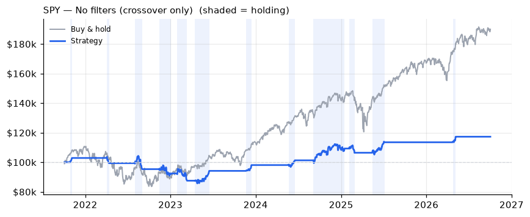
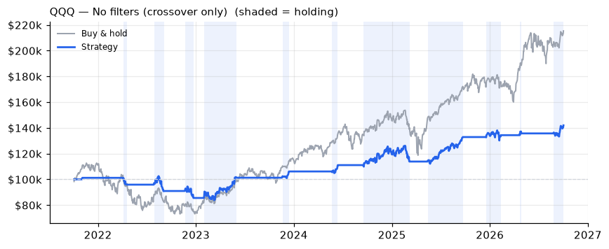

# Moving-Average Crossover Trading Bot

An automated daily trading bot for US ETFs that trades a 20/50-day moving-average
crossover, confirmed by up to five technical filters, on an **Alpaca paper trading**
account. It includes a Windows Task Scheduler setup that runs it every trading morning,
per-run logging, and a backtester that runs the exact same decision code over historical
data.

> **Disclaimer:** This project is for educational purposes only. It is configured for
> paper trading (simulated money) and is **not financial advice**. Trading involves risk
> of loss; past or backtested performance does not predict future results. Use at your
> own risk.

## Features

- **Strategy:** 20/50-day SMA crossover with optional trend, RSI, MACD, volume and ADX filters
- **Exits:** bearish crossover, RSI overbought, or a 2× ATR stop loss below entry
- **Risk controls:** never buys twice or sells shares it doesn't own (no shorting), only
  trades while the market is open, skips symbols with pending orders, optional
  1%-of-equity risk-based position sizing
- **Multi-symbol:** SPY and QQQ by default, each with its own position and stop
- **Dry-run mode:** logs what it would do without placing orders (on by default)
- **Scheduler:** runs once per trading day at 9:35 AM US Eastern, all year round, from any time zone
- **Logging:** every run writes all indicator values, filter results and the action taken
- **Backtester:** no look-ahead, slippage costs, filter-by-filter comparison, charts

## Strategy

All settings live in [`config.py`](config.py); every filter and exit rule has an on/off switch.

**Entry (BUY)** when the 20-day SMA crosses above the 50-day SMA between the last two
completed days **and** every enabled filter agrees:

| # | Filter | Condition | Purpose |
|---|--------|-----------|---------|
| 1 | Trend  | Close > 200-day SMA | only buy in a long-term uptrend |
| 2 | RSI (14) | 50 ≤ RSI ≤ 70 | positive momentum, not overbought |
| 3 | MACD (12, 26, 9) | MACD line > signal line | momentum confirmation |
| 4 | Volume | Volume > 20-day average volume | the move has real participation |
| 5 | ADX (14) | ADX > 20 | market is trending, not choppy |

**Exit (SELL the whole position)** if **any** of these happen:

- the 20-day SMA crosses below the 50-day SMA
- RSI rises above 75 (take profit)
- price is at or below the stop: entry price − 2 × ATR(14) at entry

Indicators are computed with pandas in [`indicators.py`](indicators.py) (Wilder smoothing
for RSI, ATR and ADX). Market data comes from yfinance; orders go through the Alpaca API.

## Project structure

```
bot.py              live bot: data, decision logic (evaluate), orders, logging, --scheduled mode
indicators.py       SMA, RSI, MACD, ATR, ADX
config.py           all strategy, risk, scheduling and backtest settings
backtest.py         backtester + filter study, writes backtests/report.html
schedule_task.ps1   registers the Windows Task Scheduler job
.env.example        template for Alpaca API credentials
docs/               charts used in this README
```

## Setup

Requires Python 3.10+ and a free [Alpaca](https://alpaca.markets) account (paper trading).

```bash
git clone <this repo>
cd <repo>
pip install -r requirements.txt
cp .env.example .env        # Windows: copy .env.example .env
```

Put your Alpaca **paper** API keys in `.env`:

```
ALPACA_API_KEY=your_api_key_here
ALPACA_SECRET_KEY=your_secret_key_here
```

`.env` is git-ignored; never commit it.

## Running the bot

```bash
python bot.py --dry-run     # evaluate and log, never place orders
python bot.py --live        # place market orders on the paper account
python bot.py               # uses DRY_RUN from config.py (default: True)
```

Signals use completed daily bars only. When the market is open, today's still-forming bar
is ignored for signals, but the stop loss is checked against the latest price.

Each run appends to:

- `logs/bot.log`: one readable line per symbol (indicators, filter PASS/FAIL/OFF, action, reason)
- `logs/runs.csv`: the same data, one row per symbol per run

Example log line:

```
2026-10-02 QQQ price=749.58 | SMA20=727.41 SMA50=716.23 SMA200=667.23 RSI=65.59 MACD=8.4118/6.6604
Vol=34467100/33875335.0 ADX=14.09 ATR=9.49 | cross=NONE trend=PASS rsi_filter=PASS macd_filter=PASS
volume_filter=PASS adx_filter=FAIL | pos=0.0 stop= | NONE -> NO TRADE | no up-crossover (crossover=NONE)
```

## Scheduling (Windows Task Scheduler)

```powershell
powershell -ExecutionPolicy Bypass -File .\schedule_task.ps1
```

This registers a task named **Trading Bot**. Because US daylight-saving changes move
9:35 AM ET around in other time zones, the task doesn't try to hit the exact minute.
Instead:

1. The script converts 9:30 ET (summer and winter) to your local time and sets a Mon–Fri
   trigger that fires every 5 minutes across that window.
2. Each trigger runs `bot.py --scheduled`, which exits immediately unless it is at or after
   9:35 ET, the **Alpaca market clock** says the market is open (this skips weekends and
   holidays), and the bot hasn't already run for that symbol today.
3. The task wakes the PC from sleep and runs as soon as possible after a missed start.
   If one symbol fails (e.g. a network error), only that symbol is retried on the next trigger.

Every trigger is recorded in `logs/scheduler.log`. Useful commands:

```powershell
Get-ScheduledTask "Trading Bot" | Get-ScheduledTaskInfo   # last/next run, result (0 = OK)
Get-Content logs\scheduler.log -Tail 20
Start-ScheduledTask "Trading Bot"                         # trigger now (skips if not time)
Disable-ScheduledTask "Trading Bot"                       # pause
Unregister-ScheduledTask "Trading Bot" -Confirm:$false    # remove
```

On macOS/Linux, a cron entry running `python bot.py --scheduled` every 5 minutes on
weekdays does the same job.

## Backtesting

```bash
python backtest.py          # or: python bot.py --backtest
```

The backtester calls the **same `evaluate()` function** as the live bot, with the same
settings from `config.py`, so the two can't drift apart. It runs the strategy with all
filters on, with no filters, and with each filter switched off one at a time on SPY and
QQQ. It then runs the best variant unchanged on IWM, DIA, XLK and XLE as a robustness
check. Output goes to `backtests/` (HTML report with charts and every trade, plus
`summary.csv` and `trades.csv`).

How the backtest stays realistic:

- **No look-ahead:** on day *t* the signal uses bars through *t−1* only; the order fills at
  day *t*'s open, matching the 9:35 ET scheduled run. Verified by re-running on truncated
  data and getting identical trades.
- **Costs:** 0.05% per side for slippage and fees (configurable).
- **Stop loss:** checked once a day at the open, like the live bot (gaps fill at the open, not at the stop).
- **Prices:** dividend-adjusted for both the strategy and buy-and-hold.
- **Sizing:** all-in, compounding, so returns compare directly with buy-and-hold.

## Backtest results

Five years of daily data (Oct 2021 – Oct 2026), $100,000 starting capital, 0.05% cost per side.

| Variant | SPY total | SPY CAGR | SPY max DD | SPY trades | QQQ total | QQQ CAGR | QQQ max DD | QQQ trades |
|---|---:|---:|---:|---:|---:|---:|---:|---:|
| **Buy & hold** | **+89.9%** | **+13.7%** | −24.5% | – | **+115.3%** | **+16.6%** | −35.1% | – |
| All filters on | 0.0% | 0.0% | 0.0% | 0 | 0.0% | 0.0% | 0.0% | 0 |
| No filters (crossover only) | +17.2% | +3.2% | −17.9% | 12 | +41.9% | +7.3% | −18.2% | 11 (+1 open) |
| Without trend filter | 0.0% | 0.0% | 0.0% | 0 | 0.0% | 0.0% | 0.0% | 0 |
| Without RSI filter | 0.0% | 0.0% | 0.0% | 0 | 0.0% | 0.0% | 0.0% | 0 |
| Without MACD filter | 0.0% | 0.0% | 0.0% | 0 | 0.0% | 0.0% | 0.0% | 0 |
| Without volume filter | +6.0% | +1.2% | −5.4% | 4 | +24.1% | +4.4% | −7.4% | 2 |
| Without ADX filter | +15.1% | +2.8% | −4.2% | 2 | +16.7% | +3.1% | −2.9% | 1 |

Crossover-only details: SPY won 58% of its trades (average win +5.1%, average loss −3.7%,
in the market 26% of the time); QQQ won 73% (average win +6.3%, average loss −5.4%, in the
market 35% of the time).

Robustness check, "Without ADX filter" on other ETFs vs. buy-and-hold:
IWM −1.9% vs +34.7%, DIA +9.3% vs +62.6%, XLK +0.1% vs +175.0%, XLE +8.9% vs +175.1%.

**SPY, crossover only vs. buy & hold** (shaded = holding)



**QQQ, crossover only vs. buy & hold**



## What I learned

- **Stacking filters can switch a strategy off entirely.** With all five filters on, the
  bot never traded SPY or QQQ in five years. Requiring every filter to agree on the
  exact day of the crossover is too strict: the crossover is a single-day event, and
  volume and ADX in particular rarely line up with it. Trend, RSI and MACD look
  harmless in the table, but only because volume and ADX were already blocking every trade.
- **No variant beat buy-and-hold** over 2021–2026, on SPY, QQQ or any of the four
  other ETFs. In a strongly rising market, being out of it 65–75% of the time costs more
  than avoiding the dips saves.
- **Crossover-only did reduce risk.** Its max drawdown was about −18% on both ETFs versus
  −24.5% (SPY) and −35.1% (QQQ) for buy-and-hold, because it spent most of the 2022 bear
  market in cash.
  Lower risk came with much lower return.
- **A handful of trades proves nothing.** The "best" variants by return/drawdown made only
  1–2 trades per symbol, and they didn't hold up on other ETFs. Results this thin are
  mostly luck.
- **Backtest the same code you trade.** Sharing one decision function between the live bot
  and the backtester, and checking for look-ahead by re-running on truncated data, made
  these results trustworthy, even though they're unflattering.

Possible next steps: let the filters confirm within a few days *after* a crossover instead
of on the same day, test on longer histories that include different market regimes, and
compare risk-adjusted metrics (e.g. Sharpe ratio) rather than raw return.

## License

[MIT](LICENSE). Educational use; not financial advice.
