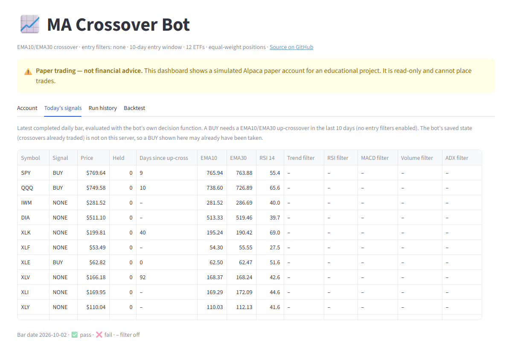
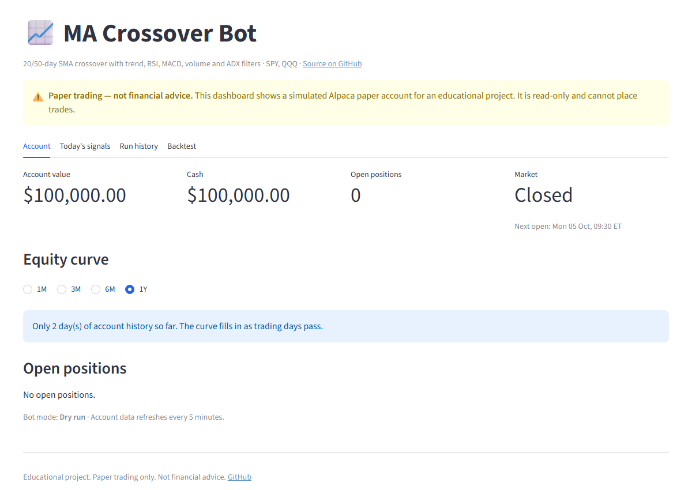
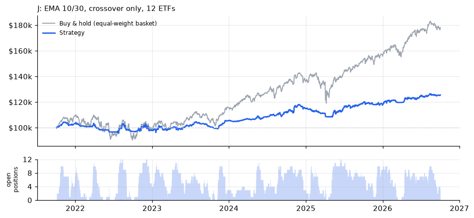
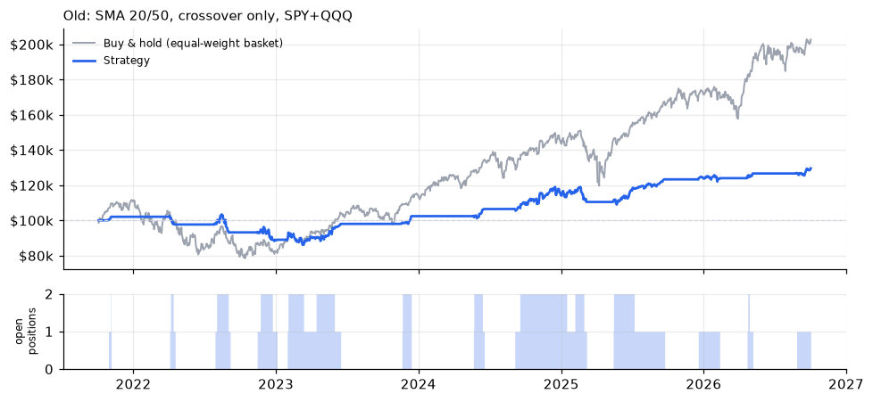

# Moving-Average Crossover Trading Bot

An automated daily trading bot that trades a 10/30-day EMA crossover across 12 liquid US
ETFs on an **Alpaca paper trading** account, with optional confirmation filters, an ATR
stop loss and equal-weight position sizing. It includes a Windows Task Scheduler setup
that runs it every trading morning, per-run logging, a portfolio backtester that runs the
exact same decision and sizing code over historical data, and a read-only Streamlit
dashboard.

**Live dashboard:** [ma-croappver-trading-bot.streamlit.app](https://ma-croappver-trading-bot-97vt9hjg2mof9trvutuqf6.streamlit.app/)



> **Disclaimer:** This project is for educational purposes only and is **not financial
> advice**. Dry-run is **off**: the bot places real orders, but only on an Alpaca
> **paper trading** account (simulated money). Trading involves risk of loss; past or
> backtested performance does not predict future results. Use at your own risk.

## Features

- **Strategy:** 10/30-day EMA crossover with a configurable entry window; five optional
  confirmation filters (trend, RSI, MACD, volume, ADX), all off in the current setup
- **Exits:** bearish crossover, RSI overbought, or a 2× ATR stop loss below entry
- **Watchlist:** SPY, QQQ, IWM, DIA and the sector ETFs XLK, XLF, XLE, XLV, XLI, XLY, XLP, XLU
- **Position sizing:** equal weight, each ETF gets equity ÷ 12, so all open positions
  together can never exceed account equity; never uses margin
- **Risk controls:** one position per ETF, never sells shares it doesn't own (no
  shorting), only trades while the market is open, skips symbols with pending orders
- **Live on paper:** `DRY_RUN = False`, orders go to the Alpaca paper account; dry-run is one flag away
- **Scheduler:** runs once per trading day at 9:35 AM US Eastern, all year round, from any time zone
- **Logging:** every run writes all indicator values, filter results and the action taken
- **Backtester:** portfolio-level, no look-ahead, slippage costs, setup comparison and filter study
- **Dashboard:** read-only Streamlit app with account, positions, equity curve, today's
  signals, run history and backtest results; deployable free on Streamlit Community Cloud

## Strategy

All settings live in [`config.py`](config.py). The current values come from the backtest
study below (setup **J**).

| Setting | Current value |
|---|---|
| Watchlist | SPY, QQQ, IWM, DIA, XLK, XLF, XLE, XLV, XLI, XLY, XLP, XLU |
| Crossover | 10-day EMA crosses above 30-day EMA (`MA_TYPE`, `FAST_MA`, `SLOW_MA`) |
| Entry window | 10 days (`ENTRY_WINDOW_DAYS`) |
| One entry per crossover | yes (`ONE_ENTRY_PER_CROSSOVER`) |
| Entry filters | none enabled |
| Exits | EMA cross down · RSI(14) > 75 · price ≤ entry − 2 × ATR(14) |
| Position size | equity ÷ 12 per ETF, whole shares, capped by available cash (`POSITION_SIZING = "equal_weight"`) |
| Mode | `DRY_RUN = False` on the paper account (`PAPER_TRADING = True`) |

**Entry (BUY)** when all of these hold for an ETF the bot doesn't own:

1. The fast EMA crossed above the slow EMA within the last `ENTRY_WINDOW_DAYS` completed days
   and is still above it. With the window, filters can confirm a few days after the
   crossover; with no filters it simply lets the bot catch up after a missed run.
2. The bot hasn't already traded that crossover (after an exit it waits for the next one).
3. Every enabled filter passes:

| Filter | Condition | Purpose |
|--------|-----------|---------|
| Trend  | Close > 200-day SMA | only buy in a long-term uptrend |
| RSI (14) | 50 ≤ RSI ≤ 70 | positive momentum, not overbought |
| MACD (12, 26, 9) | MACD line > signal line | momentum confirmation |
| Volume | Volume > 20-day average volume | the move has real participation |
| ADX (14) | ADX > 20 | market is trending, not choppy |

**Exit (SELL the whole position)** if **any** of these happen:

- the fast EMA crosses below the slow EMA
- RSI rises above 75 (take profit)
- price is at or below the stop: entry price − 2 × ATR(14) at entry

Indicators are computed with pandas in [`indicators.py`](indicators.py) (Wilder smoothing
for RSI, ATR and ADX). Market data comes from yfinance; orders go through the Alpaca API.

## Project structure

```
bot.py              live bot: data, decision logic (evaluate), sizing (position_size), orders, logging
indicators.py       SMA/EMA, crossover age, RSI, MACD, ATR, ADX
config.py           all strategy, sizing, scheduling and backtest settings
backtest.py         portfolio backtester: setup comparison + filter study
schedule_task.ps1   registers the Windows Task Scheduler job
streamlit_app.py    read-only dashboard (Streamlit)
.env.example        template for Alpaca API credentials (bot)
.streamlit/         dashboard theme + secrets.toml.example (dashboard credentials)
logs/runs.csv       run history, committed so the dashboard can show it
docs/               screenshots, plus backtest results (docs/backtest/) used by README and dashboard
```

## Setup

Requires Python 3.10+ and a free [Alpaca](https://alpaca.markets) account (paper trading).

```bash
git clone <this repo>
cd <repo>
pip install -r requirements.txt
cp .env.example .env        # Windows: copy .env.example .env
```

Put your Alpaca **paper** API keys in `.env`:

```
ALPACA_API_KEY=your_api_key_here
ALPACA_SECRET_KEY=your_secret_key_here
```

`.env` is git-ignored; never commit it.

## Running the bot

```bash
python bot.py               # uses DRY_RUN from config.py (currently False: places paper orders)
python bot.py --dry-run     # evaluate and log, never place orders
python bot.py --live        # place market orders on the paper account
```

Signals use completed daily bars only. When the market is open, today's still-forming bar
is ignored for signals, but the stop loss is checked against the latest price. The ATR at
entry and the last crossover traded per ETF are kept in `bot_state.json` (git-ignored).

Each run appends to:

- `logs/bot.log`: one readable line per symbol (indicators, filter PASS/FAIL/OFF, action, reason)
- `logs/runs.csv`: the same data, one row per symbol per run

Example log line:

```
2026-10-02 XLE price=62.82 | EMA10=62.5 EMA30=62.47 SMA200=55.88 RSI=51.65 MACD=-0.0199/0.2245
Vol=29238100/34641940.0 ADX=18.72 ATR=1.21 | cross=UP age=0 trend=OFF rsi_filter=OFF macd_filter=OFF
volume_filter=OFF adx_filter=OFF | pos=0.0 stop= | BUY -> NO TRADE (BUY 132 blocked: market closed
(next open 2026-10-05 09:30:00-04:00)) | up-crossover today; no entry filters enabled
```

## Scheduling (Windows Task Scheduler)

```powershell
powershell -ExecutionPolicy Bypass -File .\schedule_task.ps1
```

This registers a task named **Trading Bot**. Because US daylight-saving changes move
9:35 AM ET around in other time zones, the task doesn't try to hit the exact minute.
Instead:

1. The script converts 9:30 ET (summer and winter) to your local time and sets a Mon–Fri
   trigger that fires every 5 minutes across that window.
2. Each trigger runs `bot.py --scheduled`, which exits immediately unless it is at or after
   9:35 ET, the **Alpaca market clock** says the market is open (this skips weekends and
   holidays), and the bot hasn't already run for that symbol today.
3. The task wakes the PC from sleep and runs as soon as possible after a missed start.
   If one symbol fails (e.g. a network error), only that symbol is retried on the next trigger.

Every trigger is recorded in `logs/scheduler.log`. Useful commands:

```powershell
Get-ScheduledTask "Trading Bot" | Get-ScheduledTaskInfo   # last/next run, result (0 = OK)
Get-Content logs\scheduler.log -Tail 20
Start-ScheduledTask "Trading Bot"                         # trigger now (skips if not time)
Disable-ScheduledTask "Trading Bot"                       # pause
Unregister-ScheduledTask "Trading Bot" -Confirm:$false    # remove
```

On macOS/Linux, a cron entry running `python bot.py --scheduled` every 5 minutes on
weekdays does the same job.

## Dashboard

[`streamlit_app.py`](streamlit_app.py) is a **read-only** dashboard: it has no buttons that
place, change or cancel orders, and only reads from Alpaca and from files in the repo.

| Tab | Shows |
|---|---|
| Account | account value, cash, open positions (of 12), market status, equity curve (Alpaca portfolio history) |
| Today's signals | one row per ETF: signal, days since the last up-crossover, EMAs, RSI and filter results, plus a detail view, all computed with the bot's own `evaluate()` |
| Run history | submitted orders and every run from `logs/runs.csv` |
| Backtest | setup comparison, filter study, equity-vs-basket chart, yearly returns, per-ETF results and every trade from `docs/backtest/` |

Add `?tab=signals`, `?tab=runs` or `?tab=backtest` to the URL to open a tab directly.



Run it locally:

```bash
cp .streamlit/secrets.toml.example .streamlit/secrets.toml   # add your paper keys; git-ignored
streamlit run streamlit_app.py
```

The dashboard reads Alpaca keys from **Streamlit secrets only** (never from `.env` or the
code). Without secrets it still shows the signals, run history and backtest tabs.
Run history and backtest results come from the repo, so they update when you commit
and push new `logs/runs.csv` or `docs/backtest/` files.

### Deploying on Streamlit Community Cloud (free)

1. Push this repo to GitHub (the dashboard reads `logs/runs.csv` and `docs/backtest/` from it).
2. Sign in at [share.streamlit.io](https://share.streamlit.io) with GitHub and click **Create app**.
3. Choose the repo, branch `main` and main file `streamlit_app.py`. Under **Advanced settings**,
   pick Python 3.12 and paste into **Secrets**:
   ```toml
   ALPACA_API_KEY = "your_paper_api_key"
   ALPACA_SECRET_KEY = "your_paper_secret_key"
   ```
4. Click **Deploy**. Secrets can be changed later under the app's **Settings → Secrets**.
5. Put the app URL in the "Live dashboard" link at the top of this README.

Use **paper** keys only. Streamlit Community Cloud apps are public by default, so anyone
with the link can see the paper account's balance and positions (never the keys, which
stay on the server).

## Backtesting

```bash
python backtest.py          # or: python bot.py --backtest
```

Every backtest decision comes from the **same `evaluate()`** and every position size from
the **same `position_size()`** as the live bot, so the two can't drift apart. Each setup is
simulated as one portfolio with shared cash across its watchlist, processing the ETFs in
the same order as the live bot each morning. The study has two parts:

1. **Setup comparison:** the old 20/50 SMA setups plus candidates A–J. The pick is the
   candidate with **3–5 trades per month** and the highest **CAGR ÷ max drawdown**.
2. **Filter study:** the current setup with each filter flipped on/off one at a time.

Output: `backtests/report.html` (full report, git-ignored) and `docs/backtest/`
(`summary.csv`, `trades.csv`, `yearly.csv` and one chart per setup, committed for the
README and dashboard).

How the backtest stays realistic:

- **No look-ahead:** on day *t* the signal uses bars through *t−1* only; the order fills at
  day *t*'s open, matching the 9:35 ET scheduled run. Verified by re-running with the last
  14 months of data removed: all 199 closed trades and the equity curve up to that date
  were identical.
- **Costs:** 0.05% per side for slippage and fees (configurable).
- **Stop loss:** checked once a day at the open, like the live bot (gaps fill at the open, not at the stop).
- **Sizing:** equal weight (equity ÷ number of ETFs), whole shares, never more than the
  available cash; the simulation asserts cash never goes negative.
- **Benchmark:** an equal-weight buy-and-hold basket of the same ETFs (bought at the first
  open, not rebalanced); prices are dividend-adjusted for both.

## Backtest results

Five years of daily data (Oct 2021 – Oct 2026), $100,000 starting capital, 0.05% cost per
side. Trades = positions opened. The basket column is equal-weight buy-and-hold of the
same ETFs as the setup.

| Setup | Trades/mo | Total | CAGR | Max DD | CAGR/DD | Win rate | Basket CAGR / max DD / CAGR/DD |
|---|---:|---:|---:|---:|---:|---:|---:|
| Old: SMA 20/50, all filters, SPY+QQQ | 0.0 | +0.0% | +0.0% | +0.0% | – | – | +15.2% / −29.7% / 0.51 |
| Old: SMA 20/50, crossover only, SPY+QQQ | 0.4 | +29.5% | +5.3% | −16.7% | 0.32 | 65% | +15.2% / −29.7% / 0.51 |
| A: EMA 9/21, all filters, 10d window, 8 ETFs | 0.8 | +2.4% | +0.5% | −3.5% | 0.13 | 44% | +14.1% / −18.5% / 0.76 |
| B: EMA 9/21, loosened filters, 10d window, 8 ETFs | 2.4 | +9.8% | +1.9% | −9.3% | 0.20 | 42% | +14.1% / −18.5% / 0.76 |
| C: EMA 10/30, loosened filters, 10d window, 8 ETFs | 2.1 | +14.4% | +2.7% | −9.0% | 0.30 | 41% | +14.1% / −18.5% / 0.76 |
| D: EMA 9/21, trend + MACD, 10d window, 8 ETFs | 2.7 | +17.0% | +3.2% | −8.0% | 0.40 | 46% | +14.1% / −18.5% / 0.76 |
| E: EMA 10/30, trend only, 10d window, 8 ETFs | 2.5 | +20.8% | +3.9% | −8.3% | 0.47 | 44% | +14.1% / −18.5% / 0.76 |
| F: EMA 9/21, loosened filters, 10d window, 12 ETFs | 3.4 | +11.8% | +2.2% | −7.0% | 0.32 | 42% | +12.3% / −17.9% / 0.68 |
| G: EMA 10/30, loosened filters, 10d window, 12 ETFs | 3.1 | +14.7% | +2.8% | −7.4% | 0.38 | 40% | +12.3% / −17.9% / 0.68 |
| H: EMA 9/21, trend + MACD, 10d window, 12 ETFs | 4.2 | +17.3% | +3.2% | −7.4% | 0.44 | 43% | +12.3% / −17.9% / 0.68 |
| I: EMA 10/30, trend only, 10d window, 12 ETFs | 3.8 | +20.1% | +3.7% | −8.4% | 0.44 | 41% | +12.3% / −17.9% / 0.68 |
| **J: EMA 10/30, crossover only, 12 ETFs** | **4.5** | **+25.5%** | **+4.6%** | **−8.3%** | **0.56** | **41%** | **+12.3% / −17.9% / 0.68** |

"Loosened" = trend + MACD + RSI 45–70 + ADX > 15, volume off. The 8-ETF watchlist is SPY,
QQQ, IWM, DIA, XLK, XLF, XLE, XLV; the 12-ETF list adds XLI, XLY, XLP, XLU.

**Why J:** it follows directly from the selection rule. Round 1 (A–E, 8 ETFs) never reached 3 trades
a month, so round 2 (F–J) ran the same designs on 12 ETFs. Of the candidates in the 3–5
trades/month range (F–J), J has the highest CAGR ÷ max drawdown (0.56) and also the
highest CAGR (+4.6%). It wins on both, at 4.5 trades a month.

Setup J in detail: 268 trades in 5 years, 41% winners, average win +6.7% vs average
loss −2.9% per trade, biggest loss −7.9% of the position (−$732). It held at least one ETF
94% of the time but on average only 5.4 of 12 positions, so roughly 45% of the account
was invested.

**Filter study on J** (each filter switched on by itself; the 10-day window lets it confirm):

| Variant of J | Trades/mo | Total | CAGR | Max DD | CAGR/DD | Win rate |
|---|---:|---:|---:|---:|---:|---:|
| Current setup | 4.5 | +25.5% | +4.6% | −8.3% | 0.56 | 41% |
| With trend filter | 3.8 | +20.1% | +3.7% | −8.4% | 0.44 | 41% |
| With RSI filter | 4.5 | +25.5% | +4.6% | −8.3% | 0.56 | 41% |
| With MACD filter | 4.3 | +25.8% | +4.7% | −8.5% | 0.55 | 41% |
| With volume filter | 3.8 | +16.0% | +3.0% | −7.4% | 0.41 | 40% |
| With ADX filter | 2.2 | +17.8% | +3.3% | −6.0% | 0.56 | 48% |

No single filter improved CAGR ÷ max drawdown meaningfully; ADX matched it with a smaller
drawdown but halved the trade count, below the 3/month target.

**J: EMA 10/30 crossover, 12 ETFs vs. equal-weight buy & hold** (bottom: open positions)



| Year | 2021 (Oct–Dec) | 2022 | 2023 | 2024 | 2025 | 2026 (Jan–Oct) |
|---|---:|---:|---:|---:|---:|---:|
| Strategy J | +3.1% | −5.1% | +7.5% | +8.9% | +2.4% | +6.8% |
| 12-ETF basket | +8.9% | −8.4% | +15.9% | +17.5% | +14.5% | +14.4% |

### Compared with the old 20/50 setup

The previous version of this bot used a 20/50 SMA crossover with all five filters on SPY
and QQQ. Over the same five years it **never traded**, and even crossover-only managed
just 0.4 trades a month. The new setup trades about 11× as often (4.5 a month). Its CAGR
is slightly lower (+4.6% vs +5.3%), but its max drawdown is half as deep (−8.3% vs −16.7%),
so CAGR ÷ max drawdown improved from 0.32 to 0.56.



(Earlier versions of this README tested each ETF separately with the whole account in
it. All numbers above use the current portfolio backtester with 50/50 sizing for the old
setups.)

## What I learned

- **Stacking filters can switch a strategy off entirely.** The original 20/50 setup with
  all five filters never traded in five years: the crossover is a single-day event, and
  volume and ADX rarely agreed with it on that exact day. A 10-day entry window lets
  filters confirm later, but it still didn't make the filters pay for themselves.
- **Trade frequency comes from breadth and speed, not from filters.** Faster EMAs (10/30,
  9/21) and a wider watchlist (8 → 12 ETFs) are what moved the bot from 0–1 to 3–5 trades
  a month. Loosening filters helped much less.
- **No variant beat buy-and-hold.** Every setup, including J, earned well under an
  equal-weight basket of the same ETFs (+4.6% vs +12.3% a year for J), and none beat the
  basket's CAGR ÷ max drawdown either (0.56 vs 0.68). A crossover system that is
  ~45% invested gives up most of the upside in a rising market.
- **What the strategy does deliver is smaller drawdowns.** J's worst drawdown was −8.3%
  vs −17.9% for its basket, and it lost 5.1% in 2022 vs 8.4% for the basket.
- **Selecting the best of many backtests overstates it.** I compared 10 candidates
  (and a wider exploratory grid of 64 combinations, whose CAGR ranged 1.6–5.3%) on the
  same five years. The differences between the top setups are small, so J's edge over
  H or I is likely noise rather than skill; expect live results to be worse.
- **Backtest the same code you trade.** One `evaluate()` and one `position_size()` shared
  by the live bot and the backtester, plus a truncated-data look-ahead check, make these
  results trustworthy, even though they're unflattering.

Possible next steps: risk-based sizing to put idle cash to work, a regime filter that
holds the basket in strong uptrends, walk-forward testing on a longer history, and
comparing Sharpe ratios rather than CAGR ÷ max drawdown alone.

## License

[MIT](LICENSE). Educational use; not financial advice.
