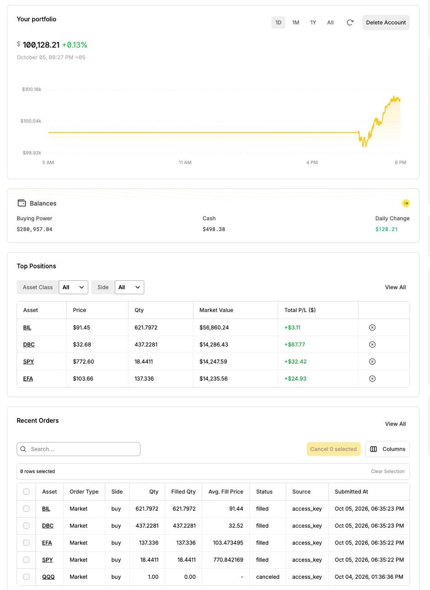

# Paper-Trading Journal (out-of-sample record)

The backtest in [`research.md`](research.md) is in-sample: the strategy was chosen on the
same 2007–2026 data it is evaluated on. This journal records the **live paper trading** that
started on 2026-10-05, the only genuinely out-of-sample evidence for the strategy. It is a
factual log, not a performance claim: a few days or weeks say nothing statistically
meaningful about a strategy whose backtest volatility is about 6% a year.

- Account: Alpaca paper trading (simulated money), starting value $100,000.00
- Strategy: trend allocation, 7 ETFs, 10-month average, BIL as cash, 4 tranches
  (rebalance days 1, 6, 11, 16 of each month), settings in [`config.py`](../config.py)
- Machine-readable log of every run: [`logs/allocation_runs.csv`](../logs/allocation_runs.csv)

## 2026-10-05 (Monday): first live run

**Signals** (closes of Friday 2026-10-02, 10-month averages):

| Asset | Close | 10-month avg | Trend | Target weight |
|---|---:|---:|---|---:|
| SPY | 769.64 | 721.56 | above | 14.3% |
| EFA | 103.96 | 101.61 | above | 14.3% |
| DBC | 32.54 | 28.28 | above | 14.3% |
| IEF | 89.05 | 92.64 | below | 0% |
| TLT | 77.48 | 83.28 | below | 0% |
| GLD | 380.14 | 408.64 | below | 0% |
| VNQ | 89.50 | 92.05 | below | 0% |
| BIL (cash) | 91.43 | – | – | 57.1% |

**Execution:** the scheduled run started at 9:35:05 ET. No saved ledger existed, so all four
tranches were set up at once (tranche 1 counts as rebalanced for October; tranches 2–4
rebalance again on October 8, 15 and 22). Four market orders, all filled within about 20
seconds:

| Order | Quantity | Avg fill price | Value | Fill vs Friday close |
|---|---:|---:|---:|---:|
| BUY SPY | 18.4411 | $770.84 | $14,215 | +0.16% |
| BUY EFA | 137.336 | $103.47 | $14,211 | −0.47% |
| BUY DBC | 437.2281 | $32.52 | $14,219 | −0.06% |
| BUY BIL | 621.7972 | $91.44 | $56,857 | +0.01% |

Total bought $99,501.62; cash left $498.38 (the 0.5% buffer); no margin used. The
differences to Friday's close are overnight price moves, not trading costs.

**Account during the day** (Alpaca, 2026-10-05 20:27 PKT = 11:27 ET, intraday, not a close):
value $100,128.21 (+0.13%), cash $498.38, unrealized P/L: DBC +$67.77, SPY +$32.42, EFA
+$24.93, BIL +$3.11.

The fifth order in the screenshot (QQQ, 1 share, 2026-10-04, canceled, 0 filled) is not from
the bot: it was a manual test order placed before the bot was set up and canceled the same day.

**Notes:** no errors or warnings in the bot log. After the run, an approved maintenance
change was deployed (duplicate-bar handling and a warning when a signal has no data); a
dry run afterwards showed no orders due and an unchanged ledger.
