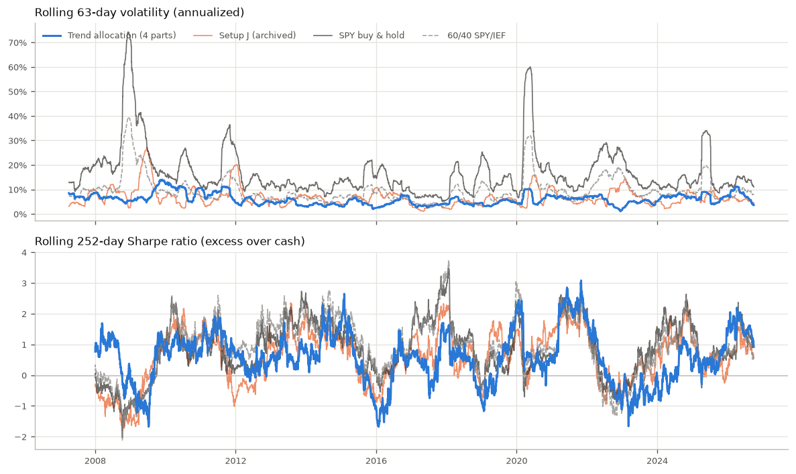

# Trend Allocation Research Report

All numbers in this report come from `python research.py` run on data ending **2026-10-02**
(downloaded 2026-10-05 10:42 UTC, combined input SHA-256
`a4a32c688cef69e55a9881620c5e4579b889a9cb91433628372030805cad5404`). The generated
tables are in [`docs/research/tables.md`](research/tables.md); the CSVs and charts in
[`docs/research/`](research/).

## Research Question

Can a simple, rules-based trend-following allocation across asset classes deliver a
better trade-off between return and loss than holding stocks (SPY) or a 60/40
stock/bond portfolio, after realistic trading costs and without look-ahead, and how
robust is that conclusion to reasonable changes in its parameters and assumptions?

## Hypothesis

Holding each asset class only while its price is above its 10-month average (Faber, 2007)
avoids a large part of prolonged bear markets. The expected effect is **lower volatility
and smaller drawdowns**, paid for with **lower returns in strongly rising markets**. No
claim of higher returns than the market was made in advance.

## Strategy

- **Universe (7 ETFs):** SPY (US stocks), EFA (developed international stocks), IEF
  (7–10-year Treasuries), TLT (20+-year Treasuries), GLD (gold), DBC (commodities), VNQ
  (US real estate).
- **Signal:** an asset is "in trend" when its close on the signal date is above the
  average of 10 monthly closes ending on that date.
- **Weights:** 1/7 of the portfolio for every asset in trend; the rest is held in **BIL**
  (0–3-month T-bills) as the defensive allocation. With no asset in trend, 100% is in BIL.
- **Four tranches (split rebalancing):** the portfolio is divided into four equal parts
  that never merge. Part *k* rebalances on trading day 1, 6, 11 or 16 of each month. This
  spreads the "timing luck" of a single rebalance date.
- **Signal dates and the 21-day approximation:** each part's signal date is the trading
  day before its rebalance. Part 1 (day 1) therefore uses calendar month-end closes, the
  standard Faber definition. Parts 2–4 have mid-month signal dates; for them the "monthly
  closes" are taken every **21 trading days back from the signal date**, an approximation of
  a month. The alternative, giving parts 2–4 the last *month-end* signal and trading it later,
  is tested in the robustness grid (it was clearly worse: Sharpe 0.49 vs 0.60).
- **Live implementation:** the same rules (`allocation.py`) drive the live bot
  (`bot.py`, paper trading since 2026-10-05). The bot keeps a 0.5% cash buffer per part,
  skips orders below $25, and invested all four parts at once on its first run.

## Data

| Item | Value |
|---|---|
| Source | Yahoo Finance via `yfinance` 1.7.0, `auto_adjust=True` (prices adjusted for splits and dividends, i.e. total-return proxies) |
| Cash / risk-free | BIL total return from 2007-05-30; before that the 13-week T-bill rate (`^IRX`) of the previous day, accrued per calendar day /360 |
| Period analysed | 2007-01-03 to 2026-10-02 (4,969 trading days) |
| Why 2007-01-03 | DBC, the newest input, starts 2006-02-06; its 11th month-end close is December 2006, so 9-, 10- and 11-month averages all exist at the first rebalance (the first trading day of 2007; 2 January 2007 was a market holiday) |
| Calendar | NYSE trading days as given by SPY; other series are aligned to it (gaps of up to 5 days forward-filled) |
| Cleaning | tz-naive dates, duplicate dates removed (last kept), sorted |
| Checksums | [`docs/research/data_manifest.json`](research/data_manifest.json): rows, date range and SHA-256 per series |

Raw data is cached locally in `data/cache/` and never committed. Indicators are computed on
each series' full history, so all averages are fully "warmed up" at the start date.

## Methodology

**Engine.** One portfolio simulation (`research.run_monthly`, `research.run_split`) with
explicit share holdings, cash and costs. On each rebalance day *d*:

1. the signal is computed from closes up to the **previous trading day** (*d − 1*);
2. orders move each holding to its target weight and **fill at d's open**;
3. sells are processed before buys; each order pays the transaction cost;
4. unallocated weight is **bought as BIL** (a tradable asset with costs);
5. equity is marked at every day's close.

Setup J, the archived daily EMA crossover, is simulated with the live bot's own
`bot.evaluate()` and `bot.position_size()` (`research.run_daily`): signals from bars
*t − 2* and *t − 1*, fills at *t*'s open.

**Look-ahead protection** is enforced by tests (`tests/test_lookahead.py`). They change
prices after a cut-off, or only the close of the rebalance day itself, and require identical
signals, orders and equity up to the cut-off. A deliberately planted leak (deciding with
day *d*'s close, or labelling regimes with the same day's close) makes these tests fail.

**Periods.** Results are reported for the full period and for 2007–2014 and 2015–2026.
The halves are robustness checks on data that was already used for the model selection;
**they are not out-of-sample tests** (see below).

## Approach Selection

Approach 1 was **selected after comparing five approaches on this same full 2007–2026
history**. The model selection is therefore **in-sample**: the reported performance of the
chosen strategy is optimistically biased, and the comparison below must not be read as
unbiased validation.

The five approaches (standard parameters, not optimized):

1. Trend allocation (Faber): 7 ETFs, 10-month average, BIL otherwise.
2. Dual momentum (Antonacci): the stronger of SPY/EFA over 12 months if it beats cash, otherwise IEF.
3. Approach 1 scaled to a 10% annual volatility target (63-day covariance, no leverage).
4. Hold by default: 12 US ETFs equal weight, any ETF below its 200-day average in cash.
5. Setup J (EMA 10/30 crossover on 12 ETFs) with a 3× ATR trailing stop.

| Strategy (full period, in-sample) | CAGR | Volatility | Sharpe | Sortino | Max DD | Calmar | Worst year |
|---|---:|---:|---:|---:|---:|---:|---:|
| 1 Trend allocation (1 part, day 1) | 5.1% | 6.6% | 0.56 | 0.77 | −12.3% | 0.41 | −4.4% (2022) |
| **1 Trend allocation (4 parts)** | **5.2%** | **6.4%** | **0.60** | **0.82** | **−9.9%** | **0.52** | **−4.9% (2015)** |
| 2 Dual momentum (12m) | 6.9% | 16.1% | 0.41 | 0.56 | −33.6% | 0.21 | −17.6% (2022) |
| 3 Trend allocation + 10% vol target | 4.9% | 6.4% | 0.55 | 0.77 | −12.3% | 0.40 | −4.4% (2022) |
| 4 Hold by default (12 ETFs, 200d) | 8.7% | 10.8% | 0.70 | 0.96 | −16.4% | 0.53 | −10.4% (2008) |
| 4 Hold by default (4 parts) | 8.3% | 11.0% | 0.65 | 0.87 | −23.1% | 0.36 | −10.3% (2008) |
| 5 Setup J + 3× ATR trailing stop | 5.6% | 7.8% | 0.56 | 0.78 | −22.1% | 0.25 | −6.3% (2008) |

The decision rule used at selection time (fixed before the split-rebalancing test): switch
to approach 4 only if every split-rebalanced variant kept its maximum drawdown at about
−20% or better (worse than −22% counted as a fail) and its Sharpe ratio above 60/40's;
otherwise use approach 1. Re-running that check with the current engine gives the same
answer: approach 4's split variants (150/200/250-day average, shifted days) have maximum
drawdowns of −22.1% to −23.8% and the 150-day variant a Sharpe of 0.60 (below 60/40's 0.63),
so approach 1 with four parts remains the choice. Approach 4 with a single rebalance day has
the best in-sample Sharpe (0.70), but its drawdown depends heavily on the day of the month it
rebalances: −16.4% (day 1), −22.2% (day 6), −27.1% (day 11), −29.9% (day 16).
These checks are regenerated by `research.py` (section "Selection rule re-checked" in
[`tables.md`](research/tables.md), file `selection_check.csv`).

## Execution Assumptions

- Decisions use completed daily bars only; orders fill at the next trading day's **open**
  (the live bot trades at about 9:35 ET).
- Fractional shares, no margin, no short selling.
- Strategies (approaches 1–4) use the live bot's execution rules: 0.5% of each part kept
  in cash, orders smaller than $25 (scaled by part size) skipped, all parts invested on the
  first day. The SPY and 60/40 benchmarks are fully invested with no buffer or minimum.
- Setup J's idle cash earns the cash rate but is not traded into BIL (so it pays no cost).
- Not modelled: taxes, bid–ask spreads beyond the flat cost, market impact, partial fills,
  dividend timing (dividends are embedded in adjusted prices), intraday price paths.

## Transaction Costs

A flat **0.05% of traded value per side** on every buy and sell, **including trades into and
out of BIL**. With BIL treated as a real asset, a move from an ETF to cash is two orders (sell
the ETF, buy BIL), which roughly doubles turnover compared with frictionless cash (one-way
turnover 176% vs 102% a year) but changes CAGR by only about 0.1 percentage points. Costs of
0, 5, 10 and 25 basis points per side are compared in the robustness grid.

## Risk Metrics

All metrics are computed by `metrics.py` from **daily** closing equity; 252 trading days per
year; NaN returns are dropped; a missing risk-free observation counts as 0.

| Metric | Definition |
|---|---|
| Total return | V_end / V_start − 1 (V_start = $100,000 the day before the first day) |
| CAGR | (V_end / V_start)^(365.25 / calendar days) − 1 |
| Average annual return | mean daily return × 252 (arithmetic, not compounded) |
| Volatility | sample standard deviation of daily returns × √252 |
| Sharpe ratio | mean(r − rf) / std(r − rf) × √252, with rf = daily return of BIL (T-bill before May 2007) |
| Downside deviation | √(mean(min(r − rf, 0)²)) × √252, averaged over **all** days (target 0) |
| Sortino ratio | mean(r − rf) × 252 / downside deviation |
| Max drawdown | min over t of V_t / max(V_0 … V_t) − 1, on daily closes, peak includes the starting value |
| Calmar ratio | CAGR / \|max drawdown\| |
| Worst year | worst complete calendar year (the partial year 2026 is excluded) |
| Positive months | share of calendar months with a positive return (a "win rate" at portfolio level) |
| Turnover | one-way: Σ\|traded value\| / portfolio value / 2, per year |
| Orders / switches / rebalances | executed orders (incl. resizes and BIL); positions opened plus closed (each part counted separately); days with at least one order — per year |

BIL as the risk-free asset includes its expense ratio (≈0.14% a year), which lowers the
risk-free rate slightly and therefore raises every Sharpe and Sortino ratio by a similar
small amount; rankings are unaffected.

## Benchmark Comparison

| Strategy (2007-01-03 to 2026-10-02) | CAGR | Volatility | Sharpe | Sortino | Max DD | Calmar | Worst year | Total return |
|---|---:|---:|---:|---:|---:|---:|---:|---:|
| **Trend allocation (4 parts)** | **5.2%** | **6.4%** | **0.60** | **0.82** | **−9.9%** | **0.52** | −4.9% (2015) | 172.3% |
| Setup J (archived) | 5.1% | 7.7% | 0.50 | 0.70 | −22.7% | 0.22 | −9.5% (2011) | 167.0% |
| SPY buy & hold | 10.9% | 19.5% | 0.55 | 0.78 | −55.2% | 0.20 | −36.8% (2008) | 675.2% |
| 60/40 SPY/IEF (monthly rebalanced) | 8.1% | 11.0% | 0.63 | 0.89 | −32.5% | 0.25 | −17.9% (2008) | 366.7% |

| Activity (full period) | Orders/yr | Switches/yr | Turnover/yr | Avg in risk assets | Positive months | Downside dev |
|---|---:|---:|---:|---:|---:|---:|
| Trend allocation (4 parts) | 286.3 | 61.1 | 175.7% | 65.6% | 62.2% | 4.6% |
| Setup J (archived) | 103.4 | 103.4 | 428.9% | 46.2% | 55.9% | 5.4% |
| SPY buy & hold | 0.1 | 0.1 | 2.5% | 100.0% | 66.0% | 13.9% |
| 60/40 SPY/IEF | 24.1 | 0.1 | 13.9% | 100.0% | 66.0% | 7.8% |

The orders count of the trend allocation counts the four parts separately and includes
small drift corrections; the live bot nets the parts into one order per ETF, so it places
fewer orders.


## Out-of-Sample Analysis

**This study contains no genuine out-of-sample test.** Every number above uses data that was
also used to choose the strategy, its universe and its tranche structure:

- the five approaches were compared on the full 2007–2026 history;
- the split-rebalancing design and the decision rule were evaluated on the same history;
- the 7-ETF universe was chosen in 2026, with knowledge of how these assets performed.

The 2007–2014 and 2015–2026 halves are therefore **robustness checks**, not out-of-sample
evidence:

| Strategy | Sharpe 2007–2014 | Sharpe 2015–2026 | CAGR 2007–2014 | CAGR 2015–2026 | Max DD 2007–2014 | Max DD 2015–2026 |
|---|---:|---:|---:|---:|---:|---:|
| Trend allocation (4 parts) | 0.68 | 0.53 | 5.6% | 5.0% | −9.9% | −9.4% |
| Setup J (archived) | 0.39 | 0.60 | 3.9% | 5.9% | −22.7% | −8.2% |
| SPY buy & hold | 0.38 | 0.71 | 6.9% | 13.8% | −55.2% | −33.7% |
| 60/40 SPY/IEF | 0.57 | 0.68 | 7.2% | 8.8% | −32.5% | −21.2% |

The trend allocation had the best Sharpe ratio of the four in 2007–2014, which includes
the 2008 crisis, and the worst in 2015–2026, a period of strong equity markets. Its drawdown
stayed below 10% in both halves.

One partial mitigation is that the 10-month rule itself was published by Faber in 2007, so
its main parameter was not fitted to the 2007–2026 data; the universe, the tranche design and
the choice among approaches were. **The only genuine out-of-sample evidence is the live paper
trading that started on 2026-10-05**; its record (`logs/allocation_runs.csv`) should be
evaluated separately once it covers a meaningful period.

## Robustness / Sensitivity Analysis

Each variant changes one assumption of the live configuration (★) over the full period. The
purpose is to measure stability, **not to select a better variant**: picking the best row
would be a new, in-sample optimization.

| Group | Variant | CAGR | Volatility | Sharpe | Sortino | Max DD |
|---|---|---:|---:|---:|---:|---:|
| Average length | 6 / 8 / 9 / **10 ★** / 11 / 12 months | 5.4 / 5.4 / 5.4 / **5.2** / 5.1 / 5.2% | 6.4–6.5% | 0.62 / 0.62 / 0.62 / **0.60** / 0.57 / 0.58 | 0.79–0.86 | −9.9% to −11.4% |
| Daily average instead | 150 / 200 / 250 days | 5.7 / 5.4 / 5.1% | 6.4–6.5% | 0.67 / 0.63 / 0.58 | 0.80–0.93 | −9.4% to −11.5% |
| Signal for parts 2–4 | **21-trading-day steps ★** vs last month-end signal | **5.2** vs 4.6% | 6.4 vs 6.7% | **0.60** vs 0.49 | 0.82 vs 0.67 | −9.9% vs −13.8% |
| Rebalance schedule | 1 part on day 1 / 6 / 11 / 16 | 5.1 / 5.2 / 5.4 / 5.2% | 6.5–6.7% | 0.56 / 0.58 / 0.60 / 0.57 | 0.77–0.83 | −12.3 / −9.8 / −13.2 / −11.4% |
| Rebalance schedule | 2 parts (1/11), **4 parts (1/6/11/16) ★**, 4 parts (3/8/13/18) | 5.2 / **5.2** / 5.5% | 6.4–6.6% | 0.59 / **0.60** / 0.62 | 0.82–0.86 | −11.6 / **−9.9** / −11.4% |
| Cost per side | 0 / **5 ★** / 10 / 25 bp | 5.4 / **5.2** / 5.0 / 4.5% | 6.4% | 0.62 / **0.60** / 0.57 / 0.49 | 0.67–0.86 | −9.8% to −10.6% |
| Universe | **7 ETFs ★** vs Faber's original 5 (SPY, EFA, IEF, DBC, VNQ) | **5.2** vs 4.9% | 6.4 vs 7.6% | **0.60** vs 0.48 | 0.82 vs 0.65 | −9.9% vs −12.3% |
| Universe | leave one out: without SPY / EFA / IEF / TLT / GLD / DBC / VNQ | 4.6 / 5.3 / 5.6 / 5.5 / 4.7 / 5.1 / 5.6% | 6.1–7.3% | 0.50 / 0.63 / 0.58 / 0.56 / 0.52 / 0.57 / 0.67 | 0.70–0.92 | −8.2% to −12.3% |
| Cash handling | **BIL with costs, buffer, minimum ★** vs frictionless cash | **5.2** vs 5.3% | 6.4% | **0.60** vs 0.61 | 0.82 vs 0.84 | −9.9% both |

Full numbers, including Sharpe by half, are in [`tables.md`](research/tables.md).


Findings:

- **Average length:** stable. Sharpe 0.57–0.62 and CAGR 5.1–5.4% for 6–12-month averages; no
  sharp optimum. The daily 150-day average scored higher (0.67), but choosing it now would be
  fitting to this history.
- **Costs:** the strategy survives realistic costs. At 25 bp per side (five times the base
  case), CAGR falls from 5.2% to 4.5% and Sharpe from 0.60 to 0.49.
- **Universe (hindsight check):** Faber's original five asset classes give a lower Sharpe
  (0.48 vs 0.60) and a deeper drawdown (−12.3% vs −9.9%). Part of the chosen strategy's
  result comes from adding TLT and GLD, a choice made with hindsight in 2026. Leaving out
  single assets moves the Sharpe between 0.50 (without SPY) and 0.67 (without VNQ), so the
  result depends noticeably on universe composition.
- **21-day approximation:** using fresh signals with 21-trading-day steps for parts 2–4 was
  clearly better than trading the stale month-end signal later (Sharpe 0.60 vs 0.49, max
  drawdown −9.9% vs −13.8%). This is an in-sample observation about a design choice, not
  independent evidence.
- **Tranches:** splitting into 2 or 4 parts mainly reduced the dependence of the maximum
  drawdown on the rebalance day (single-day versions range from −9.8% to −13.2%).

## Regime Analysis

Regime labels use only information available at the previous close (`regimes.py`):

- **Bull / bear:** day *t* is "bull" if SPY's close on *t − 1* is above its 200-day simple
  average on *t − 1*, otherwise "bear".
- **High / low volatility:** realized volatility on *t − 1* is the standard deviation of
  SPY's last 63 daily returns × √252; day *t* is "high" if that value exceeds the **expanding
  median** of all realized-volatility values up to *t − 1* (at least 252 values), else "low".

Days without enough history get no label. Tests change the close of day *t* itself and
require the label for *t* to stay the same.

| Regime (share of days) | Trend allocation | Setup J | SPY | 60/40 |
|---|---:|---:|---:|---:|
| Bear (21%): annualized compounded return | 1.6% | 5.3% | 9.5% | 8.4% |
| Bear: annualized volatility | 6.4% | 10.6% | 34.1% | 18.8% |
| Bull (79%): annualized compounded return | 6.2% | 5.1% | 11.3% | 8.0% |
| Bull: annualized volatility | 6.4% | 6.7% | 13.3% | 7.7% |
| High volatility (46%): annualized compounded return | 5.7% | 5.7% | 9.9% | 8.0% |
| Low volatility (54%): annualized compounded return | 4.8% | 4.6% | 11.8% | 8.2% |


The trend allocation does **not** earn more than the benchmarks in bear regimes. SPY
compounded 9.5% a year on bear-regime days because the strongest rebounds (2009, 2020)
happen while SPY is still below its 200-day average. What changes is risk: the strategy's
volatility stays about 6.4% in every regime, while SPY's rises from 13% to 34% in bear
regimes. Its main property is a stable, low-volatility return path, not crisis profits.



## Results

1. Over 2007–2026 the chosen trend allocation returned **5.2% a year** (CAGR) with **6.4%
   volatility** and a **−9.9% maximum drawdown**, after costs.
2. It had **lower returns** than SPY (10.9%) and 60/40 (8.1%), and a **Sharpe ratio (0.60)
   slightly below 60/40 (0.63)** but above SPY (0.55) and setup J (0.50).
3. Its advantage is **loss control**: maximum drawdown −9.9% vs −32.5% (60/40) and −55.2%
   (SPY); Calmar 0.52 vs 0.25 and 0.20; the worst calendar year −4.9% vs −17.9% and −36.8%.
   It gained 1.9% in 2008, gained 4.5% in 2020, and lost 4.1% in 2022.
4. The result is **stable** across average lengths (6–12 months), rebalance schedules and
   realistic costs, but **depends on the universe**: Faber's original five assets gave a
   Sharpe of 0.48.
5. All of this is **in-sample** with respect to the model selection.

## Reproducibility

```bash
pip install -r requirements.txt
python research.py            # downloads data ending 2026-10-02, writes docs/research/ and data_manifest.json
python research.py --offline  # reruns from data/cache/ and checks every series against the manifest
pytest                        # 61 offline tests (no network, no API keys)
```

- **Fixed end date:** 2026-10-02 (`research_data.END`).
- **Manifest:** `docs/research/data_manifest.json` records the source, download time,
  yfinance version and, per series, the first/last date, row count and SHA-256 of a
  canonical CSV (dates as YYYY-MM-DD, values rounded to 6 decimals), plus a combined hash.
- **Comparing inputs:** two researchers whose combined SHA-256 matches used identical
  data, and the results will be identical. Yahoo revises adjusted history after each
  dividend, so a later download can legitimately produce different hashes; the offline mode
  reports any mismatching series instead of silently changing the results.
- Raw data is not committed (`data/` is git-ignored).

## Limitations

- **Backtests are not forecasts.** Past performance, simulated or real, does not guarantee
  future results.
- **In-sample model selection.** The approach, its universe and the tranche design were
  chosen on the same 2007–2026 data that is reported, after comparing five approaches (and,
  earlier in the project, setup J's own parameters on 2021–2026). The reported performance
  is biased upward by an unknown amount.
- **Universe hindsight / survivorship.** All ETFs exist today; the 7-asset list was chosen
  in 2026. Faber's original universe performed worse in this test.
- **Short history.** 20 years contain one financial crisis, one pandemic crash and one
  inflation shock; ETF data does not allow a longer test of this exact strategy.
- **Costs and execution.** A flat 0.05% per side does not capture wider spreads or gaps in
  stressed markets, market impact, partial fills or taxes. Fills at the open are an
  approximation of the live bot's 9:35 ET market orders.
- **Data quality.** Yahoo Finance adjusted prices are a total-return proxy, can be revised,
  and are not an official index source. BIL's expense ratio is included in the risk-free rate.
- **Approximations.** Parts 2–4 use 21-trading-day steps instead of calendar months.
  Missing prices are forward-filled for at most five days; an asset without enough history
  counts as "not in trend" (its share goes to BIL).
- **Regime analysis is descriptive.** Regime labels are known in advance, but the regime
  definitions (200-day average, 63-day volatility) were chosen by the researcher.
- **Parameter sensitivity.** Results vary with the average length, rebalance day and
  especially the universe; small differences between variants are within the range of
  noise for a 20-year sample.

## Conclusion

On this history, the 7-ETF trend allocation with four tranches behaved as hypothesized: it
had much smaller drawdowns and lower, steadier volatility than SPY and 60/40, and it gave up
a large part of their returns (5.2% vs 10.9% and 8.1% a year). Its risk-adjusted return was
similar to 60/40 (Sharpe 0.60 vs 0.63); it did not beat the market. The results were stable
across average lengths, rebalance schedules and realistic costs, but sensitive to the
choice of assets, and they are in-sample because the strategy was selected on the same
data. Whether it holds up out of sample will only be known from the paper-trading record
that started on 2026-10-05.

## References

- Faber, M. T. (2007). *A Quantitative Approach to Tactical Asset Allocation.* The Journal of
  Wealth Management, 9(4), 69–79.
- Antonacci, G. (2014). *Dual Momentum Investing.* McGraw-Hill.
- Sortino, F. A., & Price, L. N. (1994). *Performance Measurement in a Downside Risk
  Framework.* The Journal of Investing, 3(3), 59–64.
